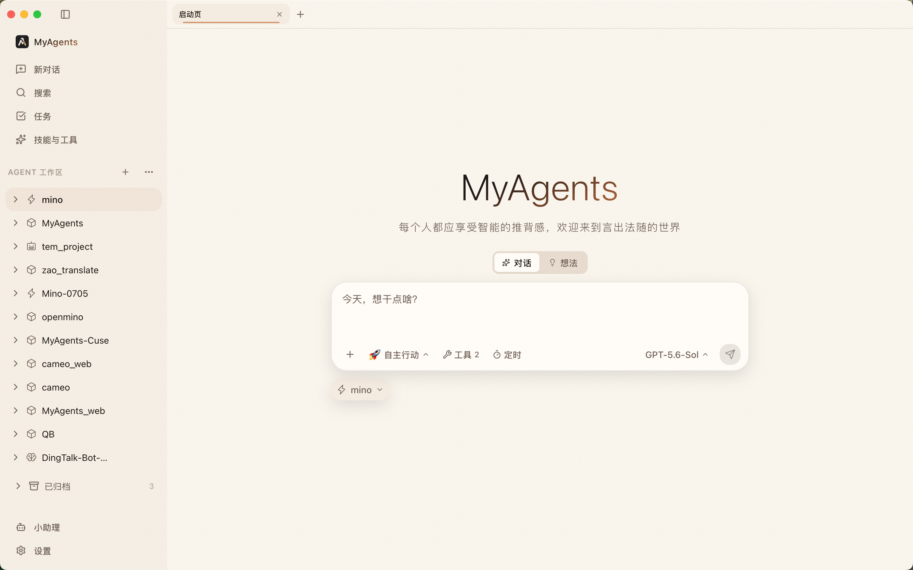
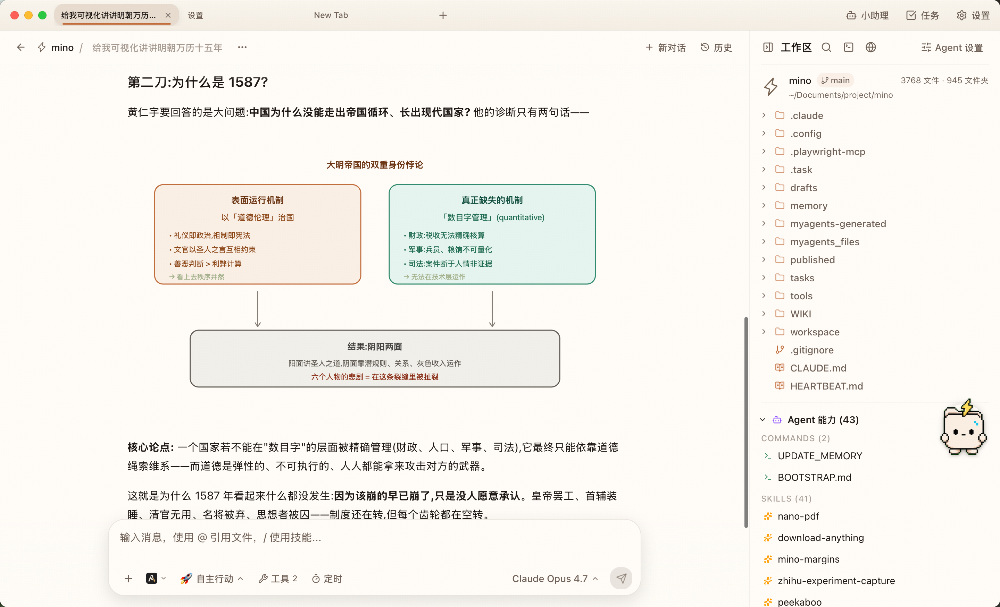

<div align="center">

# WhaleAI

**基于 MyAgents 桌面 Agent 架构的私有开发仓库**

[架构](specs/ARCHITECTURE.md) · [GEO 移植契约](specs/tech_docs/geo_port_contract.md) · [贡献指南](CONTRIBUTING.md) · [安全策略](SECURITY.md)

[](https://tauri.app/)
[](https://react.dev/)
[](https://nodejs.org/)



</div>

> [!IMPORTANT]
> `WhaleAI` 是当前仓库名称；应用、包名、CLI、配置目录和大量内部标识仍以 `MyAgents` / `myagents` 为准。本仓库不会用文档层面的改名掩盖尚未完成的代码级迁移。

## 项目定位

WhaleAI 是一个本地优先的桌面 Agent 工作台。它把聊天、工作区文件、终端、浏览器、模型、工具、技能、任务和长期会话放在同一个桌面系统中，让 Agent 可以围绕真实项目持续工作。

当前代码基线同时包含“小鲸同学”GEO 领域的第一阶段移植契约：它固定了品牌工作区、知识权威、GEO Operation、产物、监测任务与确定性发布调度之间的 owner 边界，以及问题评分、知识检索、渠道召回、模型路由和人工确认语义。

## 核心能力

- **本地工作区 Agent**：多标签会话、文件树、预览、全文搜索、内嵌终端与内嵌浏览器。
- **多模型与多 Runtime**：内置 Claude Agent SDK，并支持 Claude Code、Codex、Gemini 等外部 Runtime。
- **开放工具生态**：MCP、Skills、自定义 Agent、OpenClaw Plugin Bridge 与 IM Channel。
- **长期任务系统**：想法、Task、Goal、Cron、后台补全与可审计执行状态。
- **进程级隔离**：每个 Session 对应独立 Sidecar，由 Tab、Task、Goal 等 owner 共享生命周期。
- **GEO 领域基线**：品牌知识、问题池、内容生产、渠道推荐、发布和观测的可执行兼容契约。



## GEO 移植基线

机器可读契约位于 [`src/shared/geo/portContract.ts`](src/shared/geo/portContract.ts)，固定以下事实：

- `BrandWorkspace` 是品牌业务边界；`Session` 只拥有聊天和 Agent 上下文。
- `KnowledgeAuthority` 是权威品牌事实的唯一接受入口。
- `GeoArtifact` 保存版本、来源与知识版本，不被后续知识更新静默改写。
- Managed Task 只负责监测唤醒，不让 Task Center 接管 GEO 状态。
- `PublishScheduler` 确定性拥有付费订单的幂等、排期、提交、同步和重试，模型不能替代。
- 五类内容固定为 `guide / showcase / ranking / news / news_light`。
- 问题评分、Embedding、混合检索、四路渠道召回、质量阈值、配额、模型路由和并发语义都有无网络 reference tests。

运行专用行为一致性测试：

```bash
npm run test:geo-contract
```

完整说明见 [`specs/tech_docs/geo_port_contract.md`](specs/tech_docs/geo_port_contract.md)。

## 架构概览

| 层级                         | 技术与职责                                               |
| ---------------------------- | -------------------------------------------------------- |
| `src/renderer/`              | React 19、TypeScript、Vite、TailwindCSS；桌面 WebView UI |
| `src/server/`                | Node.js v24 Sidecar、Agent Runtime、HTTP/SSE 与业务服务  |
| `src/server/session-engine/` | Builtin / External Runtime 的统一 Session facade         |
| `src/server/plugin-bridge/`  | 独立 OpenClaw Plugin Bridge 进程                         |
| `src/cli/`                   | 随应用发布的 `myagents` CLI                              |
| `src/shared/`                | Renderer / Server 共用的纯类型、策略与契约               |
| `src-tauri/`                 | Tauri v2 Rust 壳、进程与持久化 owner、系统能力           |
| `bundled-agents/`            | 内置 Agent                                               |
| `bundled-skills/`            | 内置 Skills                                              |
| `specs/`                     | 架构、设计、模块技术文档与构建指南                       |

关键不变量：

- `Session : Sidecar = 1 : 1`，全部 owner 释放后才停止进程。
- Chat Tab 的普通 HTTP/SSE 控制面通过 Rust 代理，不能直接连接 Sidecar。
- 工作区文件 IO 归 Tauri/Rust 所有，不依赖 Sidecar。
- Session 操作统一经过 `session-engine` facade，route handler 不自行分叉 Runtime。
- 配置写入以磁盘最新状态为基线，并在锁内合并。
- 模型只提交候选或结构化决策，不能绕过领域 authority 或确定性 scheduler。

更完整的 owner、数据流和进程图见 [`specs/ARCHITECTURE.md`](specs/ARCHITECTURE.md)。

## 开发环境

### 要求

- Node.js `>=22`，推荐项目内置基线 Node.js 24。
- npm `11.13.0`。
- Rust `1.92.0`，以 [`rust-toolchain.toml`](rust-toolchain.toml) 为准。
- macOS 13+、Windows 10+，或具备 Tauri/WebKit 依赖的现代 Linux。

### 获取代码

仓库是私有仓库，需要对应 GitHub 访问权限。

```bash
git clone git@github.com:1caruszhang/whaleai.git
cd whaleai
npm ci
```

macOS / Linux 的完整开发环境：

```bash
./setup.sh
./start_dev.sh
```

Windows：

```powershell
.\setup_windows.ps1
.\build_dev_win.ps1
```

### 常用命令

```bash
npm run typecheck          # TypeScript 类型检查
npm run lint               # ESLint、依赖边界与 Agent 文档验证
npm run test:unit          # 纯逻辑测试
npm run test:dom           # React/jsdom 测试
npm run test:integration   # 无真实网络/凭据的集成测试
npm run test:geo-contract  # GEO 行为一致性基线
npm test                   # 默认完整测试套件
```

真实 Provider / SDK smoke tests 只能在明确配置测试凭据后手动运行：

```bash
npm run test:credentialed
```

默认测试、提交和 CI 不得读取真实用户目录、真实密钥或真实网络服务。

## 文档导航

- [`specs/ARCHITECTURE.md`](specs/ARCHITECTURE.md)：系统 owner、进程边界与主数据流。
- [`specs/DESIGN.md`](specs/DESIGN.md)：界面、布局、交互和设计系统。
- [`specs/tech_docs/pit_of_success.md`](specs/tech_docs/pit_of_success.md)：可执行边界、helper 与跨语言护栏。
- [`specs/tech_docs/session_architecture.md`](specs/tech_docs/session_architecture.md)：Session、恢复、配置与 Sidecar 生命周期。
- [`specs/tech_docs/multi_agent_runtime.md`](specs/tech_docs/multi_agent_runtime.md)：Claude Code、Codex、Gemini Runtime。
- [`specs/tech_docs/task_center.md`](specs/tech_docs/task_center.md)：Task、Thought、Goal 与调度。
- [`specs/tech_docs/plugin_bridge_architecture.md`](specs/tech_docs/plugin_bridge_architecture.md)：Plugin Bridge 与 OpenClaw。
- [`specs/tech_docs/geo_port_contract.md`](specs/tech_docs/geo_port_contract.md)：GEO 移植契约与行为基线。
- [`CONTRIBUTING.md`](CONTRIBUTING.md)：贡献流程、分支、提交与验证要求。
- [`SECURITY.md`](SECURITY.md)：漏洞报告与敏感数据要求。

## 安全与隐私

- 不提交 `.env`、API key、OAuth token、会话记录、日志、用户目录或客户资料。
- `.env.example` 只能包含占位值；真实凭据必须保存在本地安全存储中。
- 公开 issue、日志和截图必须先移除路径、邮箱、访问令牌和业务数据。
- 外部 URL、附件、工作区路径和 MCP 配置必须经过现有安全边界处理。

发现漏洞时不要创建公开 issue，请按 [`SECURITY.md`](SECURITY.md) 使用私密渠道报告。

## 贡献

提交遵循 Conventional Commits，并且必须包含解释“为什么”和关键取舍的正文。开始修改前先阅读 [`CLAUDE.md`](CLAUDE.md) / [`AGENTS.md`](AGENTS.md) 以及任务命中的 `specs/tech_docs/` 文档。

仓库可能包含其他会话的未提交工作；只暂存任务范围内的文件，不使用 `git add .` 或 `git add -A` 扩大提交范围。

## English

WhaleAI is the private development repository for the current MyAgents-based desktop Agent codebase. It combines local workspaces, isolated Session Sidecars, multiple AI runtimes, MCP, Skills, scheduled work, and a machine-readable GEO port contract. The application and package identifiers remain `MyAgents` / `myagents` until a complete code-level migration is performed.

See the [architecture](specs/ARCHITECTURE.md), [GEO contract](specs/tech_docs/geo_port_contract.md), [contribution guide](CONTRIBUTING.md), and [security policy](SECURITY.md) before making changes.
